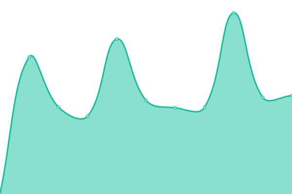
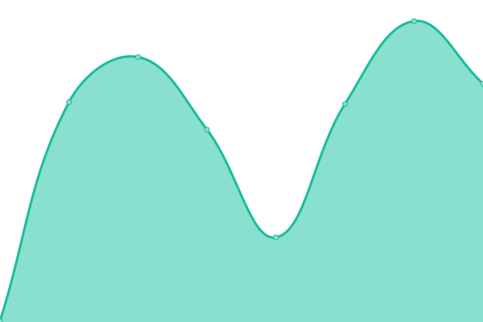
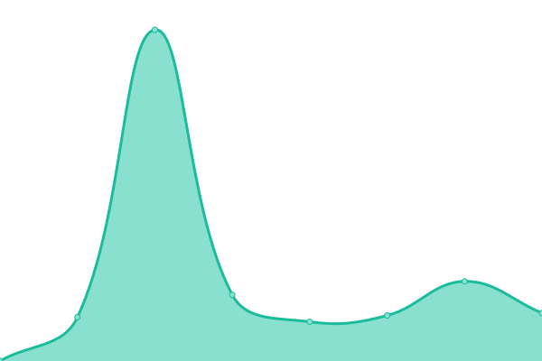

# [📈 Live Status](https://demo.upptime.js.org): <!--live status--> **🟧 Partial outage**

This repository contains the open-source uptime monitor and status page for [Jota](https://jota.one), powered by [Upptime](https://github.com/upptime/upptime).

With [Upptime](https://upptime.js.org), you can get your own unlimited and free uptime monitor and status page, powered entirely by a GitHub repository. We use [Issues](https://github.com/jota-one/upptime/issues) as incident reports, [Actions](https://github.com/jota-one/upptime/actions) as uptime monitors, and [Pages](https://demo.upptime.js.org) for the status page.

<!--start: status pages-->
<!-- This summary is generated by Upptime (https://github.com/upptime/upptime) -->
<!-- Do not edit this manually, your changes will be overwritten -->
<!-- prettier-ignore -->
| URL | Status | History | Response Time | Uptime |
| --- | ------ | ------- | ------------- | ------ |
|  [Jota One](https://jota.one) | 🟩 Up | [jota-one.yml](https://github.com/jota-one/upptime/commits/HEAD/history/jota-one.yml) | 

 1093ms
     
 | 

<a href="https://status.jota.one/history/jota-one">100.00%</a>
    

|  [Urban Training](https://www.urban-training.ch/fr) | 🟩 Up | [urban-training.yml](https://github.com/jota-one/upptime/commits/HEAD/history/urban-training.yml) | 

 1236ms
     
 | 

<a href="https://status.jota.one/history/urban-training">100.00%</a>
    

|  [Des Gouttes & Associés](https://desgouttes.ch) | 🟩 Up | [des-gouttes-and-associes.yml](https://github.com/jota-one/upptime/commits/HEAD/history/des-gouttes-and-associes.yml) | 

 793ms
     
 | 

<a href="https://status.jota.one/history/des-gouttes-and-associes">100.00%</a>
    

|  [Ferenc Farkas](https://ferencfarkas.org) | 🟩 Up | [ferenc-farkas.yml](https://github.com/jota-one/upptime/commits/HEAD/history/ferenc-farkas.yml) | 

 895ms
     
 | 

<a href="https://status.jota.one/history/ferenc-farkas">100.00%</a>
    

|  [Ferenc Farkas Medias](https://media.ferencfarkas.org) | 🟩 Up | [ferenc-farkas-medias.yml](https://github.com/jota-one/upptime/commits/HEAD/history/ferenc-farkas-medias.yml) | 

 536ms
     
 | 

<a href="https://status.jota.one/history/ferenc-farkas-medias">100.00%</a>
    

|  [Be Zulu!](https://bezu.lu) | 🟩 Up | [be-zulu.yml](https://github.com/jota-one/upptime/commits/HEAD/history/be-zulu.yml) | 

 235ms
     
 | 

<a href="https://status.jota.one/history/be-zulu">100.00%</a>
    

|  [Be Zulu! Medias](https://media.bezu.lu) | 🟩 Up | [be-zulu-medias.yml](https://github.com/jota-one/upptime/commits/HEAD/history/be-zulu-medias.yml) | 

 468ms
     
 | 

<a href="https://status.jota.one/history/be-zulu-medias">100.00%</a>
    

|  [Ls Flex](https://ls-flex.com) | 🟩 Up | [ls-flex.yml](https://github.com/jota-one/upptime/commits/HEAD/history/ls-flex.yml) | 

 1002ms
     
 | 

<a href="https://status.jota.one/history/ls-flex">100.00%</a>
    

|  [Billing Djinn](https://billingdjinn.jota.one) | 🟩 Up | [billing-djinn.yml](https://github.com/jota-one/upptime/commits/HEAD/history/billing-djinn.yml) | 

 879ms
     
 | 

<a href="https://status.jota.one/history/billing-djinn">100.00%</a>
    

|  [BlaBlind](https://blablind.jota.one) | 🟩 Up | [bla-blind.yml](https://github.com/jota-one/upptime/commits/HEAD/history/bla-blind.yml) | 

 738ms
     
 | 

<a href="https://status.jota.one/history/bla-blind">100.00%</a>
    

|  [Notification Test](https://notification-test-temporaire.invalid) | 🟥 Down | [notification-test.yml](https://github.com/jota-one/upptime/commits/HEAD/history/notification-test.yml) | 

 0ms
     
 | 

<a href="https://status.jota.one/history/notification-test">70.41%</a>
    

<!--end: status pages-->

[**Visit our status website →**](https://demo.upptime.js.org)

## 📄 License

- Powered by: [Upptime](https://github.com/upptime/upptime)
- Code: [MIT](./LICENSE) © [Anand Chowdhary](https://anandchowdhary.com), supported by [Pabio](https://pabio.com)
- Data in the `./history` directory: [Open Database License](https://opendatacommons.org/licenses/odbl/1-0/)
